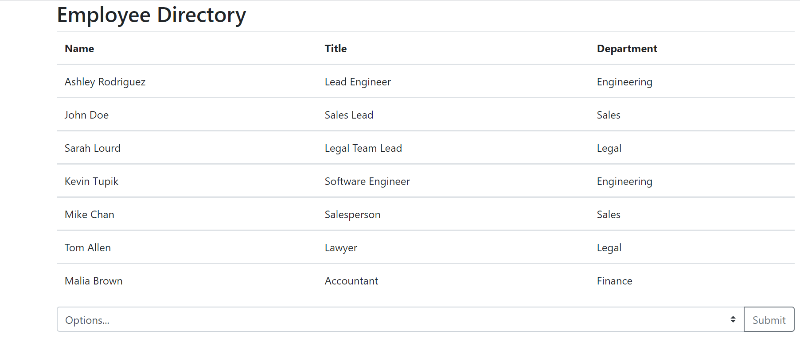

# 19EmployeeDirectory

## User Story

```
AS A user,
I WANT to be able to view my entire employee directory at once
SO THAT I have quick access to their information.
```

## Description

This React app is an employee directory that allows a manager or other amployee to view nonsensitive data about all of the employees.  Its starting functions are sorting employees alphabetically by name, and filtering employees to show the engineers.  Future functionality would include the ability to also filter by name and title.

## Completed

```
* Created as React app
* Used Bootstrap classes
* Used React class components and state
```

## Application URL

https://robynp108.github.io/19EmployeeDirectory/

## Application Screenshot


